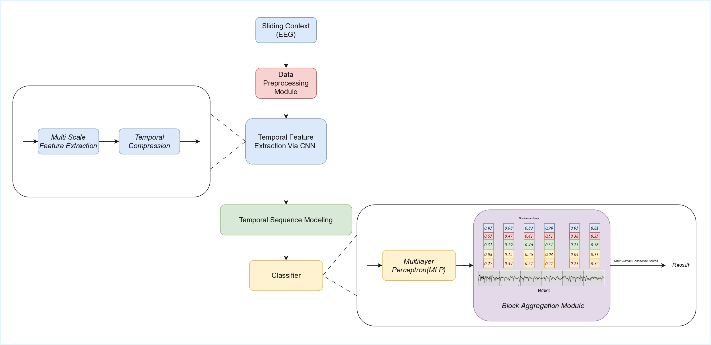
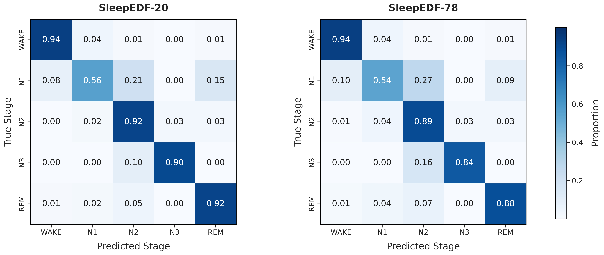
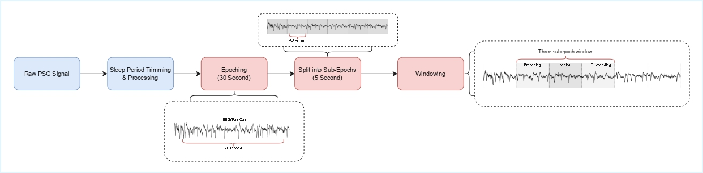
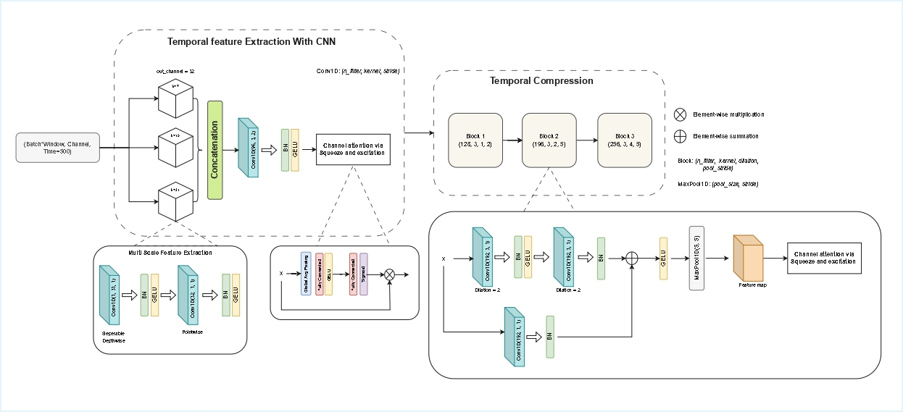
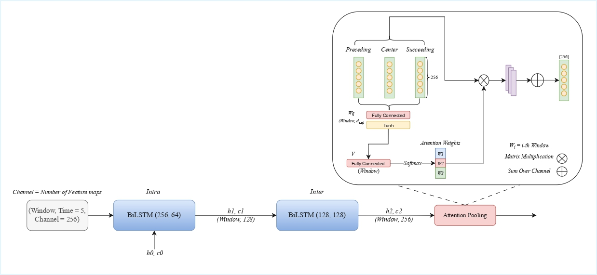
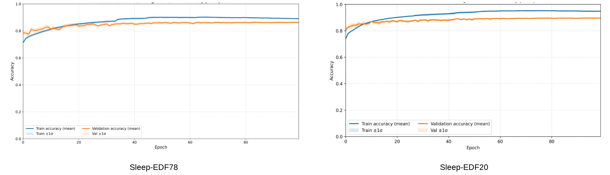
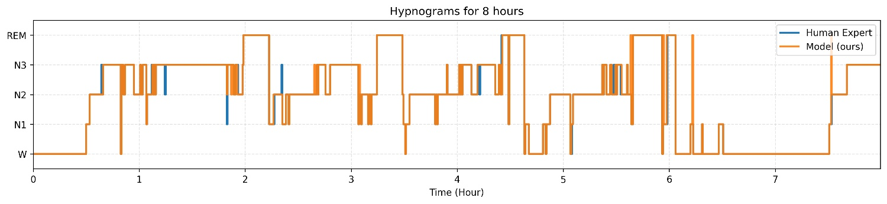
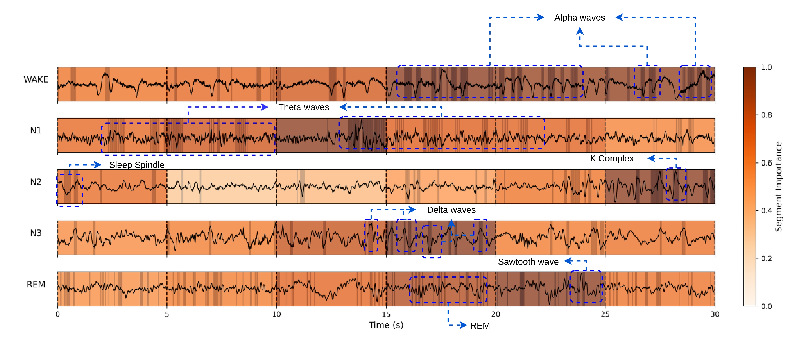
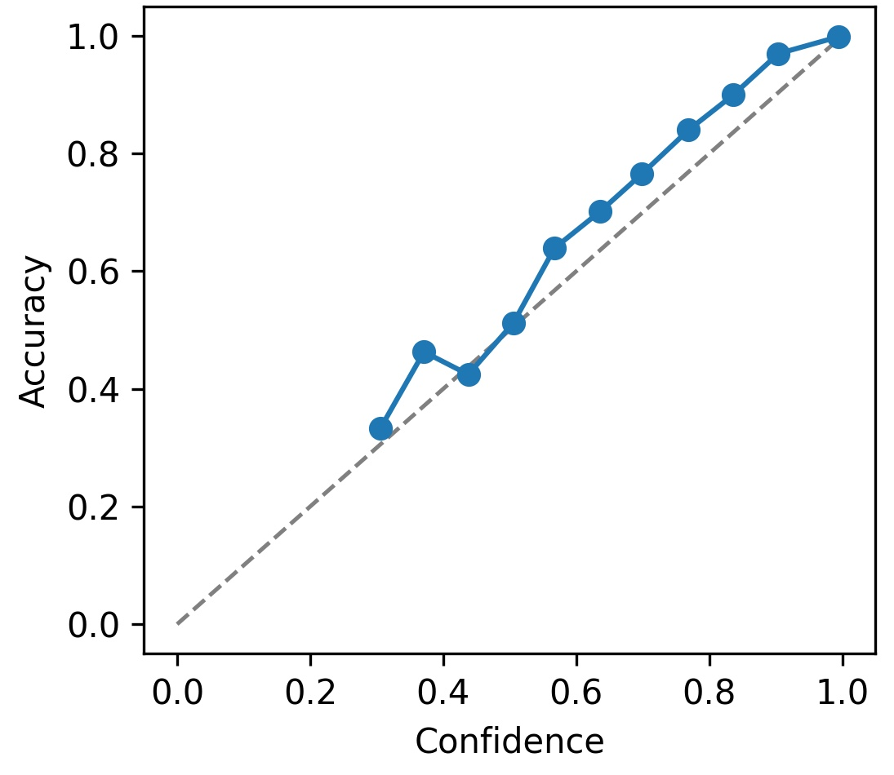
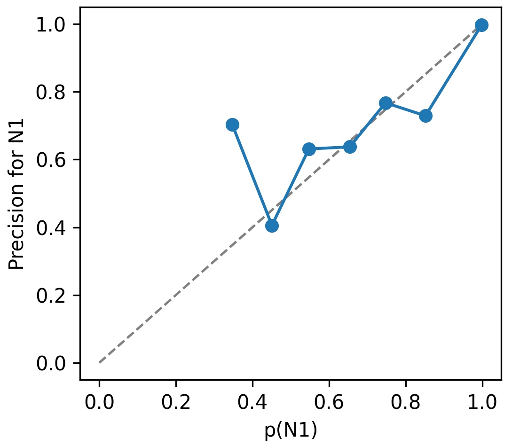

<div align="center">

# TempoSleep

### Context-Aware Single-Channel EEG Sleep Staging

**Unified multi-scale temporal encoding and hierarchical sequence learning for automatic sleep staging**

[](https://www.python.org/)
[](https://pytorch.org/)
[](LICENSE)
[](https://physionet.org/content/sleep-edfx/1.0.0/)
[](#reproducibility)

**Amirali Vakili · Salar Jahanshiri · Armin Salimi-Badr**  
Faculty of Computer Science and Engineering, Shahid Beheshti University, Tehran, Iran

<!-- Replace the text below with the public arXiv abstract URL when available. -->
**Paper:** [arXiv link](https://arxiv.org/abs/2512.22976)

</div>

---

CHRONOS is a context-aware framework for automatic sleep staging from a **single EEG channel**. It combines compact multi-scale feature extraction with temporal compression and hierarchical sequence modeling to capture local waveform structure and longer-range sleep context. Class-weighted learning and EEG augmentation address class imbalance, with particular emphasis on the challenging N1 stage.

The repository provides the modular PyTorch implementation used to reproduce the core experimental workflow: memory-efficient data loading, leakage-safe grouped cross-validation, training, checkpointing, block-level evaluation, and paper-aligned metrics.

<p align="center">
  
</p>

<p align="center"><em>Overview of CHRONOS: context construction, multi-scale temporal encoding, temporal compression, hierarchical sequence modeling, classification, and block-level aggregation.</em></p>

## Highlights

- Single-channel **Fpz-Cz EEG** input sampled at 100 Hz
- Compact multi-scale temporal encoder with kernel sizes 7, 15, and 31
- Residual, dilated temporal compression from 500 samples to five latent steps
- Hierarchical bidirectional LSTMs for intra-window and inter-window context
- Inverse-frequency class-weighted cross-entropy and configurable EEG augmentation
- Five-fold stratified grouped cross-validation with disjoint block identifiers
- Block-level prediction through aggregation of sub-epoch outputs
- Centralized accuracy, Cohen's kappa, macro-F1, sensitivity, specificity, AUROC, and per-class metrics
- Approximately **1.52 million trainable parameters** and a **5.8 MB** model footprint

## Reported results

The following values are reported in the accompanying manuscript under five-fold cross-validation.

| Dataset | Accuracy | Cohen's κ | Macro-F1 | Sensitivity | Specificity | N1 F1 |
|:--|--:|--:|--:|--:|--:|--:|
| SleepEDF-20 | **89.72** | **85.85** | **85.46** | **84.78** | **97.16** | **61.70** |
| SleepEDF-78 | **86.41** | **81.25** | **81.97** | **81.86** | **96.39** | **59.00** |

All values are percentages except Cohen's κ, which is displayed on the same 0-100 scale used in the manuscript.

### Per-class performance

| Dataset | Stage | F1 | Precision | Sensitivity | Specificity | AUROC |
|:--|:--|--:|--:|--:|--:|--:|
| SleepEDF-20 | Wake | 94.80 | 95.70 | 93.90 | 99.00 | 99.70 |
|  | N1 | **61.70** | 68.90 | 56.00 | 98.20 | 95.90 |
|  | N2 | 91.40 | 90.80 | 91.90 | 93.30 | 98.00 |
|  | N3 | 89.70 | 89.70 | 89.70 | 98.40 | 99.40 |
|  | REM | 89.80 | 87.30 | 92.40 | 97.00 | 99.10 |
| SleepEDF-78 | Wake | 95.00 | 96.00 | 94.00 | 98.60 | 99.46 |
|  | N1 | **59.00** | 64.00 | 54.00 | 97.00 | 93.29 |
|  | N2 | 87.00 | 86.00 | 89.00 | 94.00 | 97.06 |
|  | N3 | 83.00 | 83.00 | 84.00 | 98.00 | 99.28 |
|  | REM | 85.00 | 85.00 | 88.00 | 96.00 | 98.72 |

<p align="center">
  
</p>

<p align="center"><em>Normalized confusion matrices. Most errors involve physiologically adjacent stages, with N1 remaining the most difficult class.</em></p>

## Method

### Context construction

Thirty-second EEG epochs are divided into non-overlapping five-second sub-epochs. Preceding, central, and succeeding sub-epochs form contextual model inputs.

<p align="center">
  
</p>

### Multi-scale encoding and temporal compression

Parallel depthwise temporal convolutions learn complementary short-, medium-, and long-range EEG patterns. Their outputs are concatenated and progressively compressed by residual dilated blocks, producing a compact representation for sequence modeling.

<p align="center">
  
</p>

### Hierarchical sequence learning

An intra-window BiLSTM captures short-term dynamics within each compressed sub-epoch representation. An inter-window BiLSTM then models contextual dependencies among neighboring windows before classification.

<p align="center">
  
</p>

> **Implementation traceability:** the manuscript diagram includes additive attention. The archived notebook implementation used for the released checkpoint returns the final inter-window BiLSTM state and does not invoke its separately defined attention module. The code preserves that behavior instead of silently changing the trained architecture. See [`IMPLEMENTATION_AUDIT.md`](IMPLEMENTATION_AUDIT.md) for the full notebook-to-package audit.

## Ablation study

The SleepEDF-20 ablation results show the incremental contribution of temporal compression, hierarchical sequence modeling, and augmentation.

| Configuration | Accuracy | Macro-F1 | Kappa | Sensitivity | Specificity | N1 F1 |
|:--|--:|--:|--:|--:|--:|--:|
| Multi-scale feature extraction | 84.39 | 80.60 | 79.16 | 84.03 | 96.21 | 53.50 |
| + Temporal compression | 86.13 | 79.85 | 80.30 | 76.37 | 95.68 | 57.00 |
| + Temporal sequence modeling | 88.53 | 83.60 | 84.08 | 80.90 | 96.10 | 59.00 |
| + Data augmentation | **89.72** | **85.46** | **85.85** | **84.78** | **97.16** | **61.70** |

## Training behavior and qualitative analysis

<p align="center">
  
</p>

<p align="center"><em>Mean training and validation accuracy across five folds; shaded regions denote ±1 standard deviation.</em></p>

<details>
<summary><strong>Expert and predicted hypnograms</strong></summary>
<br>
<p align="center"></p>
<p align="center"><em>Expert annotations and model predictions over an eight-hour SleepEDF-20 recording.</em></p>
</details>

<details>
<summary><strong>Physiological segment-importance analysis</strong></summary>
<br>
<p align="center"></p>
<p align="center"><em>Representative segment importance across stages, highlighting alpha, theta, spindle, K-complex, delta, and sawtooth activity.</em></p>
</details>

<details>
<summary><strong>Prediction calibration</strong></summary>
<br>
<table><tr><td></td><td></td></tr></table>
<p align="center"><em>Reliability diagrams for overall predictions and the N1 class. The manuscript reports an overall expected calibration error of 0.010.</em></p>
</details>

## Repository structure

```text
.
├── configs/                  # Dataset and experiment configurations
├── Figs/                     # Architecture and manuscript figures
├── scripts/
│   ├── train.py              # Train one grouped CV fold
│   ├── evaluate.py           # Evaluate a saved checkpoint
│   └── cross_validate.py     # Run all configured folds
├── src/sleep_staging/
│   ├── data/                 # Dataset, augmentation, loaders, and splits
│   ├── models/               # Multi-scale, compression, sequence, and full model
│   ├── training/             # Loss, trainer, early stopping, checkpoints
│   ├── evaluation/           # Block aggregation and paper metrics
│   └── utils/                # Configuration, device, seed, and logging
├── tests/                    # Shape, leakage, metrics, and equivalence tests
├── IMPLEMENTATION_AUDIT.md   # Traceability and known notebook discrepancies
├── pyproject.toml
└── requirements.txt
```

## Installation

```bash
git clone https://github.com/simbovk/CHRONOS-Single-Channel-EEG-Sleep-Staging.git
cd CHRONOS-Single-Channel-EEG-Sleep-Staging

python -m venv .venv
source .venv/bin/activate       # Windows: .venv\Scripts\activate
python -m pip install --upgrade pip
python -m pip install -e .
```

For development and tests:

```bash
python -m pip install pytest
pytest -q
```

## Data preparation

The raw Sleep-EDF Expanded dataset is publicly available from [PhysioNet](https://physionet.org/content/sleep-edfx/1.0.0/). The dataset is **not redistributed** in this repository.

The experiment scripts expect preprocessed NumPy arrays in a user-supplied directory:

```text
DATA_DIR/
├── X_EEG_EOG.npy           # [N, W, T, C_source]
├── y_EEG_EOG.npy           # [N], integer labels 0...4
└── block_ids_EEG_EOG.npy   # [N], grouping/aggregation identifiers
```

For the verified SleepEDF-20 export:

- Source input: Fpz-Cz EEG, selected as channel index `0`
- Model sample after selection: `[W=3, T=500, C=1]`
- Sampling frequency: 100 Hz
- Label order: `Wake, N1, N2, N3, REM`
- Arrays are opened with `numpy.load(..., mmap_mode="r")`

Paths are never hard-coded. `DATA_DIR` may point to local storage, a mounted drive, a server volume, or HPC storage.

> The paper reports experiments on SleepEDF-20 and SleepEDF-78. The original SleepEDF-78 exported filenames were not present in the supplied notebooks; therefore `configs/sleepedf78.yaml` retains explicit placeholders rather than invented paths. Confirm these fields before running that configuration.

## Usage

### Train one fold

```bash
python scripts/train.py \
  --config configs/sleepedf20.yaml \
  --data-dir /path/to/preprocessed/sleepedf20 \
  --output-dir outputs/sleepedf20 \
  --fold 1
```

### Run five-fold cross-validation

```bash
python scripts/cross_validate.py \
  --config configs/sleepedf20.yaml \
  --data-dir /path/to/preprocessed/sleepedf20 \
  --output-dir outputs/sleepedf20
```

### Evaluate a checkpoint

```bash
python scripts/evaluate.py \
  --config configs/sleepedf20.yaml \
  --data-dir /path/to/preprocessed/sleepedf20 \
  --checkpoint outputs/sleepedf20/best_model_fold1.pth \
  --fold 1 \
  --output outputs/sleepedf20/evaluation_fold1.json
```

Use `--device cuda`, `--device mps`, or `--device cpu` to choose a backend explicitly. Without this flag, the package selects CUDA, then Apple MPS, then CPU.

## Experimental configuration

| Setting | Value |
|:--|:--|
| Cross-validation | 5-fold stratified grouped CV |
| Batch size | 128 |
| Maximum epochs | 100 |
| Learning rate | 1 × 10⁻⁴ |
| Weight decay | 1 × 10⁻⁴ |
| Optimizer in released code | AdamW |
| Loss | Inverse-frequency weighted cross-entropy |
| Scheduler | ReduceLROnPlateau |
| Scheduler factor / patience | 0.5 / 7 epochs |
| Early-stopping patience | 30 epochs |
| Checkpoint criterion | Validation accuracy |

## Reproducibility

The release centralizes seeds for Python, NumPy, PyTorch, and CUDA and requests deterministic cuDNN behavior. Exact bitwise reproducibility can still depend on the PyTorch version, backend, GPU architecture, and nondeterministic kernels.

The test suite verifies:

- Dataset shape, label type, and channel selection
- Disjoint group IDs across train and validation folds
- Reproducible fold generation
- Full-model output shape `[batch_size, 5]`
- Paper metric conventions on a hand-verifiable example
- The reported **1,515,424** trainable-parameter count
- Numerical equivalence between the extracted legacy forward path and modular model

## Citation

If you use this repository, please cite the accompanying paper. BibTeX will be updated when the arXiv identifier is available:

```bibtex
@article{vakili2026chronos,
  title   = {A Context-Aware Temporal Modeling through Unified Multi-Scale Temporal Encoding and Hierarchical Sequence Learning for Single-Channel EEG Sleep Staging},
  author  = {Vakili, Amirali and Jahanshiri, Salar and Salimi-Badr, Armin},
  year    = {2026},
  note    = {Preprint; arXiv identifier forthcoming},
  url     = {https://github.com/simbovk/CHRONOS-Single-Channel-EEG-Sleep-Staging}
}
```

Please also cite the Sleep-EDF data source according to the instructions on [PhysioNet](https://physionet.org/content/sleep-edfx/1.0.0/).

## License

This project is released under the [MIT License](LICENSE). Sleep-EDF remains subject to its original PhysioNet data-use and citation terms.

## Acknowledgments

We thank the maintainers and contributors of Sleep-EDF Expanded and PhysioNet. This repository is released to support transparent, inspectable, and reproducible research in automatic sleep staging.

---

<div align="center">

If CHRONOS supports your research, please cite the paper and consider starring the repository.

</div>
